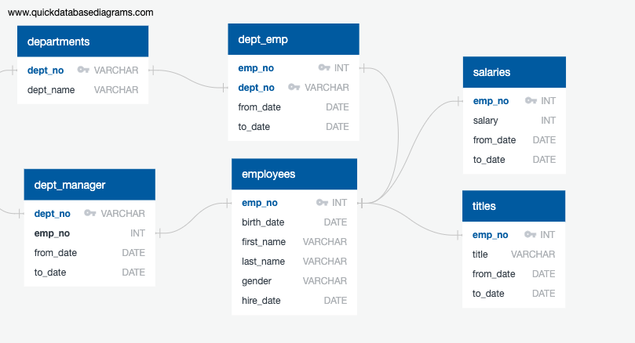
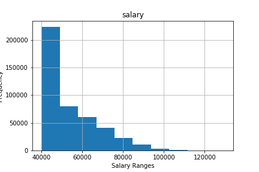
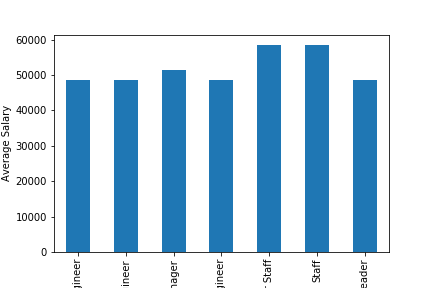

Conduct a research project on employees of the corporation from the 1980s and 1990s. All that remain of the database of employees from that period are six CSV files.

Design the tables to hold data in the CSVs, import the CSVs into a SQL database, and answer questions about the data. In other words, perform the following:

1. Data Modeling
2. Data Engineering
3. Data Analysis
4. Visualization in Python ( Pandas and matplotlib.pyplot)

## Data Modeling

#### ERD development based on CSV data

## Data Engineering

* Table schema were created based on the six CSV files. Data types, primary keys, foreign keys, and other constraints were specified.

* Imported each CSV file into the corresponding SQL table.

## Data Analysis

#### Salary by employee
SELECT  emp.emp_no,
        emp.last_name,
        emp.first_name,
        emp.gender,
        sal.salary
FROM employees as emp
    LEFT JOIN salaries as sal
    ON (emp.emp_no = sal.emp_no)
ORDER BY emp.emp_no;

#### Employees hired in 1986
SELECT first_name, last_name
FROM employees
WHERE hire_date BETWEEN '1986-01-01' AND '1986-12-31';

#### Manager of each department
SELECT  dm.dept_no,
        d.dept_name,
        dm.emp_no,
        e.last_name,
        e.first_name,
        dm.from_date,
        dm.to_date
FROM dept_manager AS dm
    INNER JOIN departments AS d
        ON (dm.dept_no = d.dept_no)
    INNER JOIN employees AS e
        ON (dm.emp_no = e.emp_no);

#### Department of each employee
SELECT  e.emp_no,
        e.last_name,
        e.first_name,
        d.dept_name
FROM employees AS e
    INNER JOIN dept_emp AS de
        ON (e.emp_no = de.emp_no)
    INNER JOIN departments AS d
        ON (de.dept_no = d.dept_no)
ORDER BY e.emp_no;

#### Employees whose first name is "Hercules" and last name begins with "B"
SELECT *
FROM employees
WHERE first_name = 'Hercules'
AND last_name LIKE 'B%';

#### Employees in the Sales department
SELECT  e.emp_no,
        e.last_name,
        e.first_name,
        d.dept_name
FROM employees AS e
    INNER JOIN dept_emp AS de
        ON (e.emp_no = de.emp_no)
    INNER JOIN departments AS d
        ON (de.dept_no = d.dept_no)
WHERE d.dept_name = 'Sales'
ORDER BY e.emp_no;

#### Employees in Sales and Development departments
SELECT  e.emp_no,
        e.last_name,
        e.first_name,
        d.dept_name
FROM employees AS e
    INNER JOIN dept_emp AS de
        ON (e.emp_no = de.emp_no)
    INNER JOIN departments AS d
        ON (de.dept_no = d.dept_no)
WHERE d.dept_name IN ('Sales', 'Development')
ORDER BY e.emp_no;

#### The frequency of employee last names
SELECT last_name, COUNT(last_name)
FROM employees
GROUP BY last_name
ORDER BY COUNT(last_name) DESC;

## Visualizations

Importing the SQL database into Pandas (Python) by using SQLAlchemy. Consult SQLAlchemy documentation for more information. https://docs.sqlalchemy.org/en/13/core/engines.html#postgresql

Create a bar chart of average salary by title.

#### Most common salary ranges for employees

#### Average salary by title

